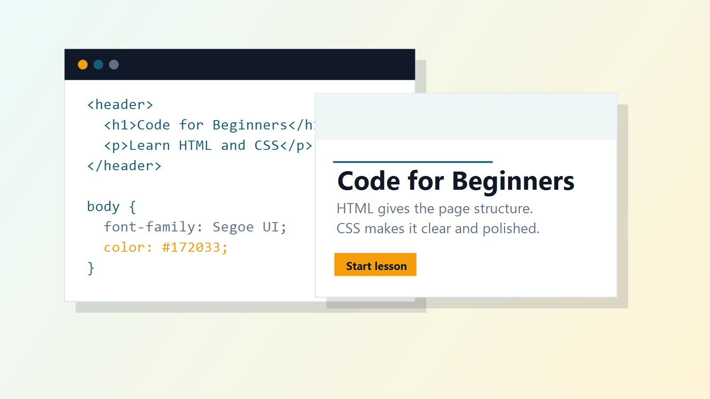

# 🌐 Frontend Basics

<p align="center">
  
</p>

<p align="center">
  <strong>An interactive learning website that teaches the fundamentals of HTML and CSS through beginner-friendly lessons, live examples, and hands-on practice.</strong>
</p>

<p align="center">
  Built with ❤️ using HTML, CSS and JavaScript.
</p>

---

## 📖 About the Project

**Frontend Basics** is an educational web project designed for beginners who want to learn the foundations of web development in a simple and interactive way.

Instead of overwhelming learners with long documentation, this project focuses on clear explanations, practical code examples, and immediate visual feedback. Every lesson is designed to help users understand not only *what* to write, but also *why* it works.

Whether you're writing your first HTML tag or styling your first webpage, Frontend Basics provides an easy and enjoyable starting point.

---

## ✨ Features

- 📚 Beginner-friendly lessons
- 💻 Interactive code examples
- 📋 One-click code copying
- 🎨 Clean and modern interface
- 📱 Responsive design
- ⚡ Fast and lightweight
- 🧠 Easy-to-follow explanations
- 📖 Structured learning path
- ♿ Accessibility-conscious layout
- 🔄 Consistent lesson format throughout

---

## 📚 Course Content

### 📄 Lesson 01 — HTML Basics

Learn the building blocks of every webpage.

Topics covered:

- What is HTML?
- HTML Document Structure
- Headings
- Paragraphs
- Links
- Images
- Lists
- Semantic HTML

---

### 🎨 Lesson 02 — CSS Basics

Learn how to style webpages using CSS.

Topics covered:

- What is CSS?
- CSS Syntax
- Selectors
- Colors
- Fonts
- Backgrounds
- Margin & Padding
- Borders
- External CSS

---

### 🚀 Lesson 03 — HTML + CSS Together

Bring HTML and CSS together to build complete webpages and understand how structure and styling work together to create beautiful websites.

---

## 🖥️ Technologies Used

- HTML5
- CSS3
- JavaScript (Vanilla)

No frameworks or libraries were used. The project was intentionally built using core web technologies to demonstrate a solid understanding of frontend fundamentals.

---

## 📂 Project Structure

```text
Frontend-Basics/
│
├── assets/
│   └── course-preview.png
│
├── index.html
├── about.html
├── html-basics.html
├── css-basics.html
├── html-css-together.html
├── styles.css
├── script.js
└── README.md
```

---

## 🎯 Purpose

This project was created as part of my personal portfolio to showcase my skills in:

- Frontend Development
- Responsive Web Design
- HTML5
- CSS3
- JavaScript
- UI/UX Design
- Educational Website Design
- Clean Code Organization

The goal wasn't simply to build another website, but to create an engaging learning experience that is easy to navigate and enjoyable to use.

---

## 🚀 Live Demo

**https://vivid162veejayant.github.io/Frontend-Basics/**

---

## 💡 Future Improvements

Although the project is complete, there are always ideas for future enhancements:

- 🌙 Dark Mode
- 📝 Interactive Quizzes
- 🏆 Progress Tracking
- 🎓 More Frontend Lessons
- ⚡ Better Animations
- 🔍 Search Functionality

---

## 🤝 Contributions

Suggestions, improvements, and feedback are always appreciated.

If you discover a bug or have an idea to improve the project, feel free to open an issue or submit a pull request.

---

## ⭐ Support

If you found this project helpful or interesting, consider giving it a **⭐ Star** on GitHub.

It helps others discover the project and motivates me to continue building and improving new ones.

---

## 👨‍💻 Author

**Veejayant Sharma**

Aspiring Programmer • Frontend Developer • Game Developer

Thank you for visiting the repository!
